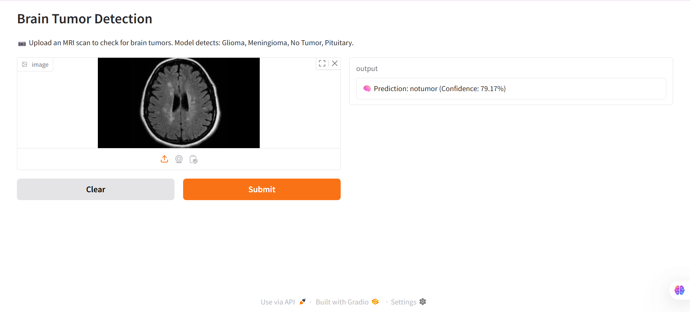

# 🧠 Brain Tumor Detection

This project uses a Convolutional Neural Network (CNN) to detect brain tumors from MRI images. It is developed using Python and TensorFlow/Keras.

---

## 📋 Project Overview

- Input: MRI brain scan images  
- Output: Classification - Tumor detected or not  
- Approach: Image preprocessing, CNN model training, evaluation, and prediction  
- Goal: Provide an automated tool to assist in early tumor detection  

---

## 📁 Project Structure
Brain-Tumor-Detection/
│
├── BrainTumorDetection.ipynb # Main notebook with code
├── model.h5 # Trained model weights
├── requirements.txt # Python dependencies
├── README.md # Project description (this file)
└── dataset/ # MRI images 

## 🚀 How to Run

1. Clone the repository:  
   ```bash
   git clone https://github.com/yashyadav01/Brain-Tumor-Detection.git
   cd Brain-Tumor-Detection

2. Install required packages:
  pip install -r requirements.txt

3. Open the notebook:
jupyter notebook BrainTumorDetection.ipynb

4.Run the notebook cells to train/evaluate or test the model.

🧪 Dependencies
>>tensorflow
>>numpy
>>matplotlib
>>opencv-python
>>(Install all dependencies with pip install -r requirements.txt)

---

## How to update README on GitHub:

- If you use **GitHub Web**:  
  - Open your repo → click `README.md` → click the **edit pencil icon** → paste the rest → scroll down → commit changes.

- If you use **Git/GitHub Desktop**:  
  - Update your local README.md file  
  - Commit & push changes

---

Let me know once you add this or if you want me to prepare the full README file in one piece so you can download and upload it!
[](demo_screenshot.png)

[](demo_screenshot2.png)


